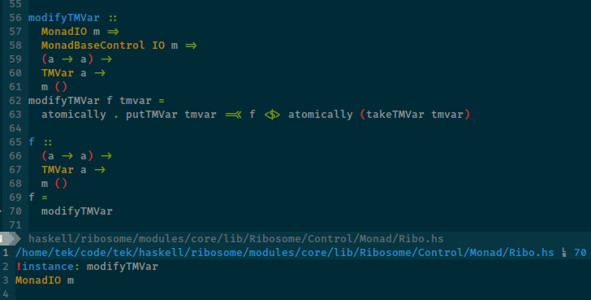

# Intro

**Myo** is a [Neovim] plugin written in [Haskell] with the plugin framework [Ribosome].

It provides several interacting features that include:
* [**UI**](#ui): automatic opening, closing and layouting of tmux panes
* [**Commands**](#commands): Execution of configurable shell commands in [tmux] or subprocesses
* [**Output**](#output): Parsing, rendering and navigation of messages produced by commands

**Myo** benefits a lot from having per-project and per-project-type configuration for setting up language-specific commands.
If you don't have a solution for this, the author also maintains [proteome], a project management plugin.



# Install

The plugin can be loaded by specifying the repo to a package manager like any other, for example by cloning it in a
subdirectory of `'packpath'` or using one of the many plugin managers.

```vim
Plug 'tek/myo'
```

Since the plugin is written in Haskell, its executable has to be fetched or built on the first start.

* If the [Nix package manager](https://nixos.org/learn.html) is available, the plugin will be fetched from the Nix cache
  (or built if the current commit isn't in the cache)
* Otherwise it will be downloaded from Github's releases.
* If the variable `g:myo_fetch_bin` is set to `1`, Nix is ignored and the binary is downloaded from Github
  regardless.

# Configuration

There are a few settings that, when changing their variables, will trigger
reconfiguration of the corresponding component:

* `myo_ui`
* `myo_commands`

**myo** uses several autocommands to detect changes.

For the examples in this Readme, I will be using a setup for compiling and testing [Scala] with [sbt].

## MyoDiag

This command will display some information about the plugin in a scratch buffer.

# UI

The purpose of the UI component is to allow creating tracked tmux panes with a fixed layout from mappings that are
cleaned up when vim quits.
The UI is configured through the variable `myo_ui` whenever it is modified.
Its schema looks like this:

```vim
let s:sbt_pane =
      \ {
      \ 'layout': 'make',
      \ 'ident': 'sbt',
      \ 'minSize': 0.5,
      \ 'maxSize': 35,
      \ 'position': 8
      \ }
let g:myo_ui = {
      \ 'panes': [s:sbt_pane]
      \ }
```

These settings will be combined with the built-in default layout that consists of determining the window and pane in
which Neovim has been started and a vertical layout named `make` positioned to the right of the Neovim pane that
contains one pane, also called `make`, which is used as the default target when executing system commands.

It is possible to set up much more complex layouts, with windows and sessions yet to come.
The `myo_ui` variable may contain a key `layouts` with the same schema as for panes.

The library used for interacting with tmux is [chiasma].

### Pane Fields

* `layout` is the name of the parent layout of the pane.
* `pin` causes this pane to be opened whenever its layout becomes visible, i.e. when another pane in it is opened.
   The default `make` pane has this set.
* `position` is a value that orders panes in a layout. It can have any numerical value.
* `fixed_size` tries to make a pane always have this number of lines or columns.
* `minimized_size`, default `2`, is the number of cells that the pane gets when minimized.
* `weight` is used to distribute surplus space onto panes.

Panes open automatically when a command is executed in them, but there are functions for doing so manually.

## MyoToggle

```vim
:MyoTogglePane sbt
```

will open the pane `sbt` in the lower right corner, or, if it is open already, minimize it to a size of two cells in the
direction of its parent layout (in this case, vertically).

## MyoFocus

This command takes a pane name and will set it as the active pane in tmux.

# Commands

A command consists of a list of shell commands and some optional values:
* a tmux pane in which to execute it
* a shell command in which to execute it
* a runner (tmux or subprocess)
* a language for parsing its output

Commands are read from the `myo_commands` variable:

```vim
let s:sbt_cmd = {
  \ 'ident': 'sbt',
  \ 'lines': ['sbt'],
  \ 'target': 'sbt',
  \ 'lang': 'scala',
  \ }
let s:compile_cmd = {
  \ 'ident': 'compile',
  \ 'lines': ['test:compile'],
  \ 'target': 'sbt',
  \ 'lang': 'scala',
  \ }
let g:myo_commands = { 'system': [s:sbt_cmd], 'shell': [s:compile_cmd] }
```

This snippet defines a _system command_ (run directly in the tmux pane) with the command line `sbt` that will be executed in the previously created pane `sbt` (defined by the `target` field).

Next, it defines a _shell command_ named `compile`, which has as its target the name of a system command, here `sbt`.
This means that when running this command, it will be sent to the tmux pane running `sbt` (it will be started if
necessary) and some interactions with it, like output parsing, will be deferred to the system command.
Its command line is `test:compile`, which is the text sent to `sbt`.

### Command Fields

* `ident` is the name of the command, to be used with `MyoRun` and `MyoParse`.
* `lines` is a list of command lines that will be executed in tmux. For subprocess commands, only one line is valid.
* `target` points to a pane or shell in which the command will be run.
* `lang` is used to find the appropriate parser for command output. Currently supported: `scala`, `haskell`.
* `runner` may be `tmux` or `proc` (simple subprocess).
* `displayName` is an optional override for the text to be displayed to the user instead of the `ident`.

### Parameter interpolation

Command lines may be template strings with references to parameters:

```vim
let ghc_test_cmd = {
  \ 'ident': 'test',
  \ 'lines': ['hadrian/build test {test_way:--test-way={test_way}} {test_options} {test_case:--only={test_case}}'],
  \ 'params': { 'test_options': '-j6' }
  \ 'target': 'make',
  \ }
```

There are three variants of interpolations:

* `{param_name}` substitutes the value and terminates with error if it is undefined
* `{param_name:}` substitutes the value or the empty string
* `{param_name:expr}` processes `expr` as a template or substitutes the empty string if the parameter is undefined

Parameter values are determined from several sources, in decreasing order of precedence:

* The nvim function `Myo_param_<name>`.
  For example, for the param `{test_case}`, the function `Myo_param_test_case` is called.
* The nvim variable `<scope>:myo_param_<name>` from the scopes `g:`, `t:`, `w:`, `b:` in that order.
  For example, `b:myo_param_test_case`.
* The default values specified in the command config's attribute `params`.
  If this is specified, the interpolation styles `{param_name:}` and `{param_name}` behave identically and always
  substitute the default as fallback.

## MyoRun

This Neovim command/function triggers the execution of a **myo** command:

```vim
MyoRun compile
```

This invocation will:
* create the tmux panes for `sbt` (which will also create `make` since it is pinned).
* run `sbt` in its pane
* send `test:compile` to the `sbt` pane

Subsequent invocations will check the stored process ID and skip the second step if it is alive.

## MyoReRun

This function allows you to run commands from the history.
For example, to run the previous command again:

```vim
:MyoReRun 0
```

## MyoHistory

This command displays the history in a scratch buffer with a prompt for substring searching.
Selecting one of the entries with `<cr>` will rerun the command.
The prompt starts in normal mode, where you can navigate with `j`/`k`, switch to insert mode with `i`, `a`, `I` and `A`, and abort with `q`, `<esc>` and `<c-c>`.

## MyoCommands

This command displays all defined commands in a menu like [`MyoHistory`](#myohistory).

## MyoVimTest

**myo** features support for [vim-test], which is a plugin with many built-in heuristics for determining the appropriate
command to execute something relating to the current cursor position.
When running this function:

```vim
:MyoVimTest
```

**myo** will call [vim-test] and execute its output in the pane or shell configured by `g:myo_test_pane` or
`g:myo_test_shell` (default being `make`).

# Output

When a command is executed, its output is read into **myo**'s state.
Running the command

```vim
:MyoParseLatest
```

Will run the appropriate parser, read from the command option `pane` or the variable `g:myo_test_lang` (currently only
`haskell or ``scala`), and display its result in a scratch window, as showcased in the screenshot at the top of the
readme.

After parsing, the cursor will be set to the last of first error (depending on the values of `g:myo_output_jump_first`
and `g:myo_output_auto_jump`).
Using the functions `MyoPrev` and `MyoNext`, you can cycle through the error list.

# Default Commands

For some languages, a default layout and command set will be set up on startup.
To prevent this, set:

```vim
let g:myo_default_commands = v:false
```

## Haskell

The commands `stack-build` and `stack-test` with `--fast --pedantic` are
created, as well as their variants without `--pedantic` that are suffixed with
`-lenient`.

A pane at the bottom of the `make` layout is created for the command `ghci`.

To prevent the stack commands from being created, set:

```vim
let g:myo_haskell_stack = v:false
```

[Neovim]: https://github.com/neovim/neovim
[Haskell]: https://www.haskell.org
[ribosome]: https://github.com/tek/ribosome
[chromatin]: https://github.com/tek/chromatin
[tmux]: https://github.com/tmux/tmux
[proteome]: https://github.com/tek/proteome
[Scala]: https://scala-lang.org
[sbt]: https://scala-sbt.org
[chiasma]: https://github.com/tek/chiasma
[vim-test]: https://github.com/janko/vim-test
[stack]: https://docs.haskellstack.org/en/stable/README
